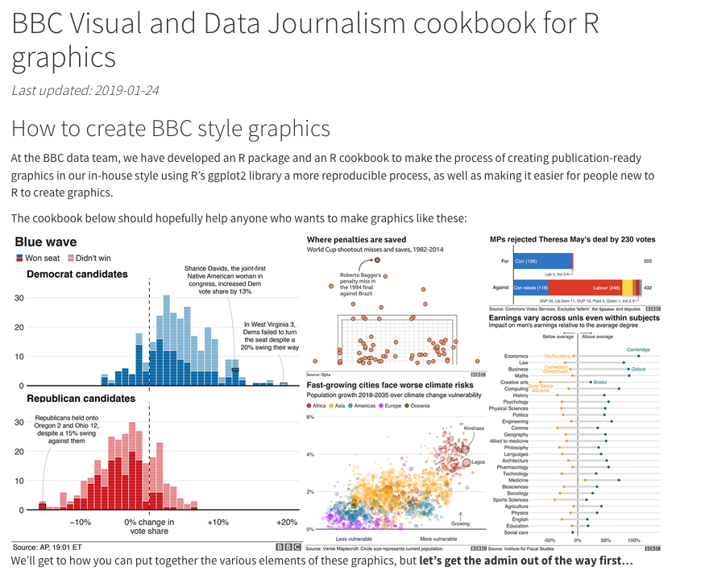

## Why R? 

-   Free and open source

-   Designed for statistics and data analysis

    -   For most cases the base statistical modelling and data-visualisation libraries

-   Modular: extend it with thousands of specialist packages

-   Encourages transparent, reproducible code rather than hidden “button-clicking”

-   Combines analysis, figures, citations, and writing in reproducible reports\\

**Why R rather than Python?**

Python is an excellent general-purpose language, while R was developed specifically for statistical computing and graphics. This does not mean that R is always better than Python. Python is often preferable for software development, machine learning systems, etc.

**Used in practice**

-   The [BBC published an R cookbook](https://bbc.github.io/rcookbook/) and the bbplot package for creating reproducible, publication-ready graphics in its house style.

-   Quarto can turn an analysis into journal-ready HTML, PDF, or Word manuscripts, with journal-specific [templates](https://quarto.org/docs/journals) available through extensions.

# Installing R

R is a programming language for statistical computing and data analysis, while RStudio provides a user-friendly interface for working with R.

1.  install R from [R Project website](https://www.r-project.org/)

2.  install [RStudio](https://www.rstudio.com/)

There are plenty of tutorials, e.g.: [psyteachr](https://psyteachr.github.io/RSetGo/)

## **RStudio**

## Actually starting

After installing both R and RStudio, open RStudio, in the Console type:

1.  `print("Hello world")`

2.  `3 + 2`

3.  `?mean`

Make a new file:

1.  In the menu File \> New File \> Rscript

2.  Type `40 + 2` in the newly created script, then click Ctrl+Enter

    Alternatively: select `40 + 2` and click on ‘Run’

3.  To save the R script: File \> Save / Save as.
