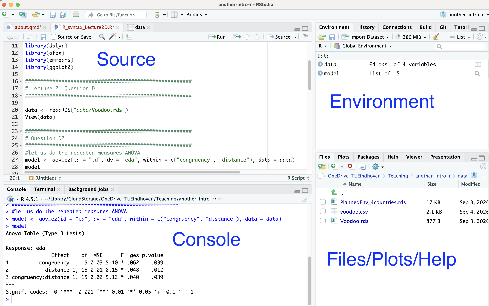

## Why R?

## Installing R

R is a programming language for statistical computing and data analysis, while RStudio provides a user-friendly interface for working with R.

1.  install R from [R Project website](https://www.r-project.org/)

2.  install [RStudio](https://www.rstudio.com/)

There are plenty of tutorials (e.g: [QLS-MiCM](https://martinahyang.github.io/IntroToR/WebsiteCodes/Setup.html))

## **RStudio**

## Actually starting

After installing both R and RStudio, open RStudio, in the Console type:

1.  `print("Hello world")`

2.  `3 + 2`

3.  `?mean`

Make a new file:

1.  In the menu File \> New File \> Rscript

2.  Type `40 + 2` in the newly created script, then click Ctrl+Enter

    Alternatively: select `40 + 2` and click on ‘Run’

3.  To save the R script: File \> Save / Save as.
