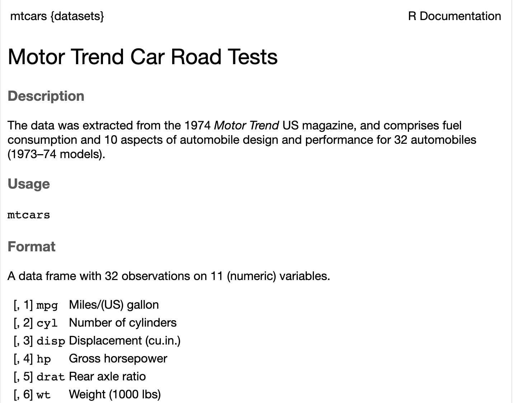

# Data frames

A data frame is a rectangular collection of vectors of equal length. Each column is a vector (a variable). Each row is an observation. Different columns can contain different types of data.

```{r}
# create one
travellers <- data.frame(
  name = c("Arthur", "Ford", "Trillian", "Zaphod"),
  planet = c("Earth", "Betelgeuse", "Earth", "Betelgeuse"),
  age = c(30, 200, 30, NA),
  towels = c(1, 2, 1, 0), 
  knows_answer = c(NA, TRUE, TRUE, FALSE))

```

```{r}
travellers
# look at the top rows
head(travellers, 2)
# look at the bottom rows
tail(travellers, 2)

names(travellers)
```

## Inspect its structure

```{r}
class(travellers$name) 
class(travellers$age) 
nrow(travellers)
ncol(travellers)
length(travellers$name) 
length(travellers$age)
dim(travellers)
```

```{r}
## easier 
str(travellers)
summary(travellers)
```

## Selecting rows and columns

```{r}
#using [ ]
#          row    columns  
travellers[3:4 , c(1, 3)]
```

```{r}
# get one column using $ and the name of the column 
travellers$age

travellers[ , c("name", "age")]
```

## Built-In Datasets

R comes with several built-in datasets that are useful for learning. Other packages can also provide their own example datasets (see int.link).

```{r}
dataset_catalog <- data()
head(dataset_catalog$results[, "Item"], 10)
```

Popular example mtcars Get information about dataset: `?mtcars`

{fig-align="center" width="430"}

```{r}
head(mtcars)
```

```{r}
str(mtcars)
```

```{r}
summary(mtcars[, 1:3])
```

## Read in a dataframe

```{r}
data <- readRDS("data/PlannedEnv_4countries.rds") 
data <- read.csv("data/voodoo.csv")
```

what is the problem with the way I have named the data frames?

::: callout-note
When you read or save a file, R needs to know where to look for it. The folder R is currently using is called the working directory.

You can check it with:

```{r}
getwd()
```

Rather than repeatedly changing the working directory with `setwd()`, it is better to work inside an RStudio project and use relative file paths.

**Tip:** Session \> Set Working Directory \> To File Source Location
:::
